# Projet 2 - Programmation orientée objet avec un jeu d'échecs :chess_pawn:

## Directives
:alarm_clock: Date de remise : Le 13 avril 2025

:mailbox_with_mail: À remettre sur Github

## Introduction
Les échecs, jeu à la fois emblématique et complexe, constituent un excellent moyen d'explorer les concepts de programmation et de logique algorithmique. Dans ce deuxième projet du cours, vous aurez pour mission de compléter un jeu d'échecs en appliquant des principes de programmation orientée objet avec Python, en utilisant la bibliothèque Pygame. 
 
## Installations requises
Ce projet nécessite l'utilisation de la bibliothèque [`pygame`](https://www.pygame.org/wiki/about), qui permet de créer facilement des interfaces de jeu en Python. Étant donné que nous avons déjà utilisé pygame pour le Projet 1, vous devriez déjà avoir les installations nécessaires pour débuter le Projet 2. Si jamais ce n'est pas le cas, vous pouvez utilisez la commande suivante dans votre terminal pour installer pygame :

```
python3 -m pip install -U pygame==2.6.0
```

## Détails sur le jeu

Cette version du jeu inclura uniquement un mode à deux joueurs ("multi player"). Afin de simplifier votre travail, l'interface graphique du jeu vous est déjà fournie. Il est possible de lancer le jeu avant même d'avoir commencé le projet : il suffit d'exécuter le fichier `main.py` pour ouvrir la fenêtre de jeu. Au tout début, l'échéquier devrait apparaître mais sera vide : il sera à vous d'y ajouter les pièces. À noter que les coordonnées (0,0) sur l'échéquier sont en haut à gauche. 

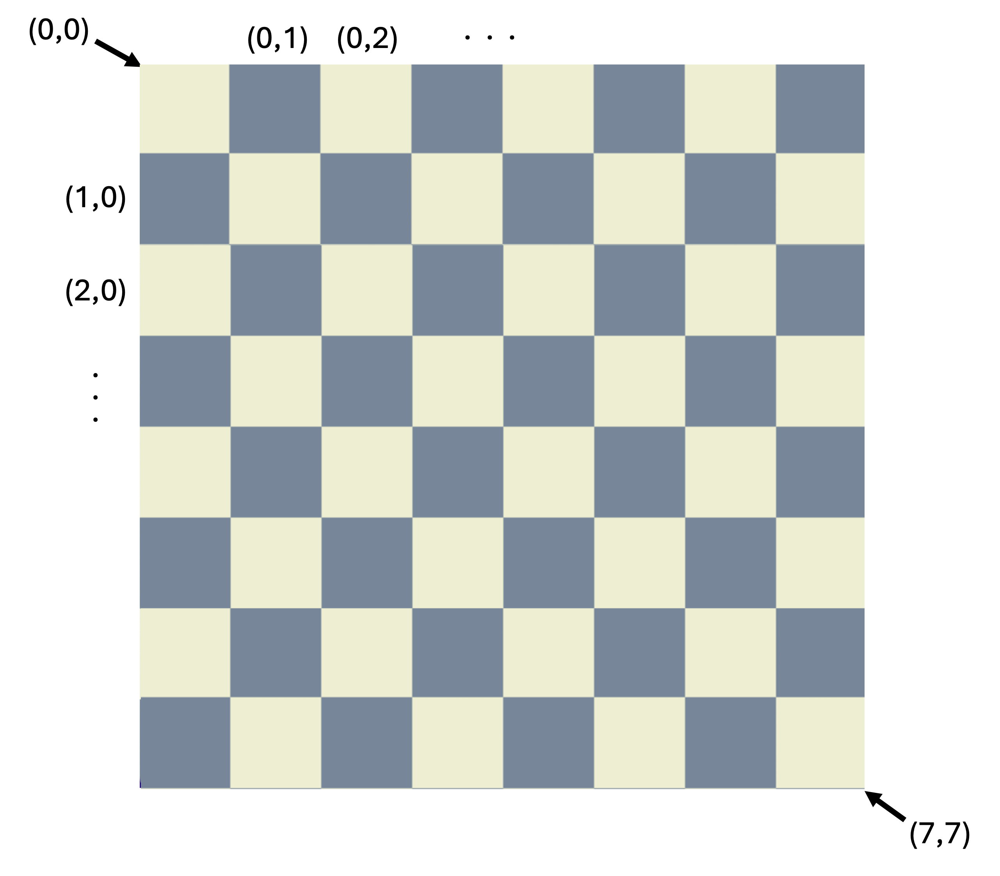

Vous aurez également à implémenter certaines fonctionalités du jeu, telles que la gestion des déplacements possibles, ainsi qu'à compléter les classes spécifiques à chaque type de pièce. Les instructions à suivre sont détaillées plus bas dans la section "Travail à réailser", et sont aussi indiquées par des #TODO dans les fichiers ".py" de ce répertoire. 

## Détails sur les fichiers

Le projet est organisé de la manière suivante : 

```plaintext
2025H_PR02/
├── board.py
├── config.py
├── main.py
├── pieces.py
```
Détails sur les fichiers : 
- Le fichier `board.py` contient l'initialisation du plateau de jeu avec les pièces, ainsi que les fonctions de base nécessaires au fonctionnement du jeu, telles que des fonctions qui gèrent le déplacement des pièces, la mise à jour du plateau suite au déplacement des pièces, etc. 
- Le fichier `config.py` regroupe des constantes essentielles, telles que les dimensions du plateau de jeu et les couleurs utilisées. Il inclut également le dictionnaire PIECE_IMAGES, qui associe chaque pièce d'échecs à son image correspondante et à sa lettre de représentation dans le jeu. 
- Le fichier `main.py` utilise Pygame pour créer l'interface graphique d'un jeu d'échecs, en affichant le plateau, les pièces et les déplacements légaux. Il charge les images des pièces depuis un dictionnaire défini dans le fichier config.py, et dessine le plateau et les pièces sur la fenêtre Pygame. Le fichier gère également l'affichage des mouvements possibles sous forme de cercles sur les cases. La boucle principale continue d'exécuter ces actions jusqu'à la fermeture de la fenêtre de jeu. 
- Le fichier `pieces.py` définit la structure de base pour la gestion des pièces d'échecs en utilisant la programmation orientée objet. On y retrouve la classe parent "Piece", qui contient des méthodes communes à toutes les pièces, telles que la gestion de la position, le nombre de mouvements et le calcul des mouvements légaux. Ensuite, des classes spécifiques pour chaque type de pièce (pion, cavalier, tour, fou, reine, roi) sont définies, chacune ayant sa propre logique pour déterminer les mouvements possibles. Le fichier inclut également des fonctions utilitaires comme "is_check", qui vérifie si un roi est en échec, et "sum_coordinates", pour effectuer des calculs de déplacement sur le plateau. Un dictionnaire "pieces_dict" permet de lier les lettres représentant les pièces à leurs classes respectives. Ce système de classes et méthodes permet de simuler un jeu d'échecs où chaque pièce peut être déplacée en fonction de ses règles spécifiques.

## Travail à réaliser

### Partie 1 : Initialisation du jeu

#### 1.1 : Initialisation du plateau

Dans cette partie, vous devrez modifier la méthode `init_board` permettant d'initialiser le plateau de jeu. Vous devrez utiliser l'attribut `self.scheme` défini dans la méthode `__init__` ainsi que le dictionnaire `pieces_dict` afin de construire un numpy array de dimension (8x8) composé uniquement d'objets:
- Les cases vides représentée par des points `.` dans `self.scheme` devront être remplacé par l'objet python `None`
- Les cases représentée par des lettres dans `self.scheme` devront être remplacées par les pièce correspondante à l'aide du dictionnaire `pieces_dict`.

> ⚠️ Il sera nécessaire d'initialiser chacune des pièce du jeu avec sa position et sa couleur. Les lettre minuscules font ici référence aux pièces blanches tandis que les majuscules aux pièces noires.

Une fois cette partie complétée, les pièces du jeu devraient apparaître sur le plateau du jeu comme suit. 

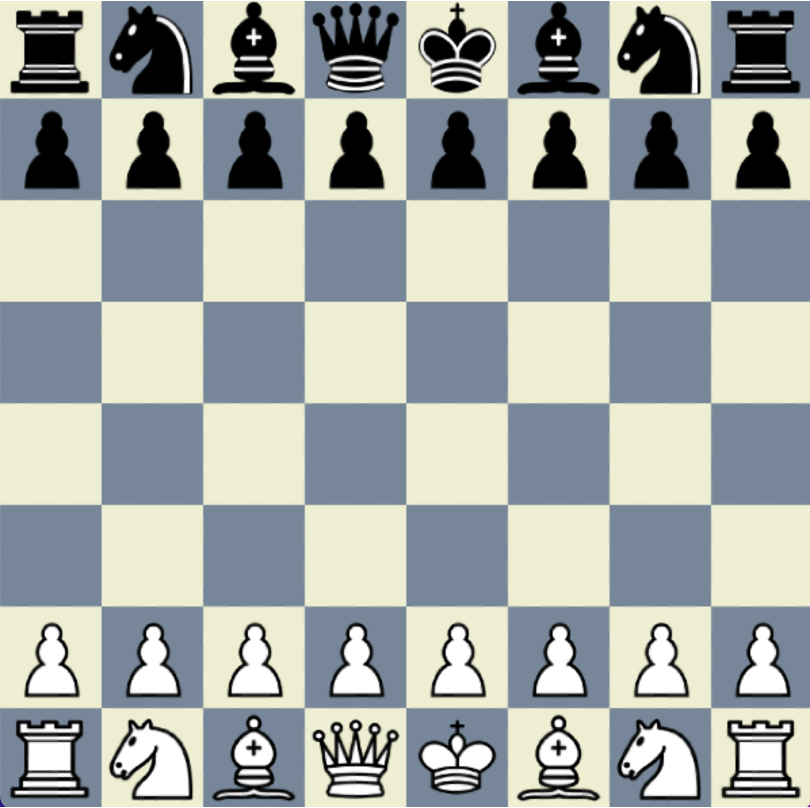


#### 1.2 : Passage du tour

Pour cette partie, l'objectif est de compléter la méthode `switch_turn` de l'objet `Board`, qui a pour rôle de modifier l'attribut `self.turn` afin d'alterner le tour du joueur à chaque mouvement effectué. Cette méthode doit changer la valeur de `self.turn` entre `white` et `black` chaque fois que cette dernière est appelée, assurant ainsi une alternance correcte des tours entre les deux joueurs.

#### 1.3 : Mouvement de pièce

Maintenant, vous devez compléter la fonction `move_piece`, qui permet de déplacer une pièce sur le plateau. La fonction prend en paramètre la position de départ (`start_pos`) et la position d'arrivée (`end_pos`) de la pièce. 

Vous devez :

- Mettre à jour l'attribut ` self.board` en déplaçant la pièce de `start_pos` à `end_pos`, en pensant bien à remplacer la position de départ par l'objet python `None`. 
- Mettre à jour l'objet de la pièce pour refléter sa nouvelle position en utilisant la méthode `set_new_pos`. 
- Actualiser l'attribut `self.last_piece` pointant vers la dernière pièce déplacée. 

### Partie 2 : Implémentation des mouvements pour chaque pièce 

Pour cette deuxième partie du projet, vous allez maintenant devoir compléter les méthodes `get_moves` dans chacune des classes pièces (fou, roi, reine, etc.) à l'intérieur du fichier `pieces.py`. Cette méthode utilise:
- l'objet `Board`
- la méthode `get_pos`
- la méthode `get_color`

Pour déterminer l'ensemble des mouvement possible de la pièce à l'instant t. Les mouvements possibles correpondant aux coordonnées d'arrivée de la pièce seront renvoyés par la méthode dans une liste appelée `moves`.

> ⚠️ Dans cette méthode il ne faudra PAS considérer les échecs qui seront expliqués dans la prochaine partie.

Cette liste des mouvement comporte à la fois les mouvement simples de la pièce mais aussi les captures de cette dernière. Concernant les principes élémentaires de ce mouvement dans la méthode `get_pos`:
- un mouvement est toujours possible sur une case vide (`None`) dans la mesure où le mouvement respecte le déplacement conventionnel de ladite pièce.
- si la case d'arrivée de la pièce est une autre pièce de la **couleur opposée** à celle qui bouge, alors ce mouvement est appelé **capture** et est considéré comme un mouvement.

> ⚠️ Pour la dame, le fou et la tour, la **capture** n'est possible que sur la première pièce rencontrée dans le mouvement. En effet, à part le cavalier, aucune autre pièce ne peut enjamber d'autres pièces. 

> À part le pion, toutes les pièces capturent de la même manière qu'elles se déplacent.

Pour vous aider, la classe pour le pion (`Pawn`) a déjà été implémentée pour vous. À noter que les classes spécifiques à chaque type de pièces héritent des fonctionalités de la classe parent `Piece`. 

#### 2.1 : Classe `Knight` (Cavalier)

Le cavalier ("knight") se déplace de deux cases dans une direction suivies d'une case dans une direction perpendiculaire, formant ainsi un "L".

> ⚠️ Il s'agit de la seule pièce capable d'enjamber les autres pièces.

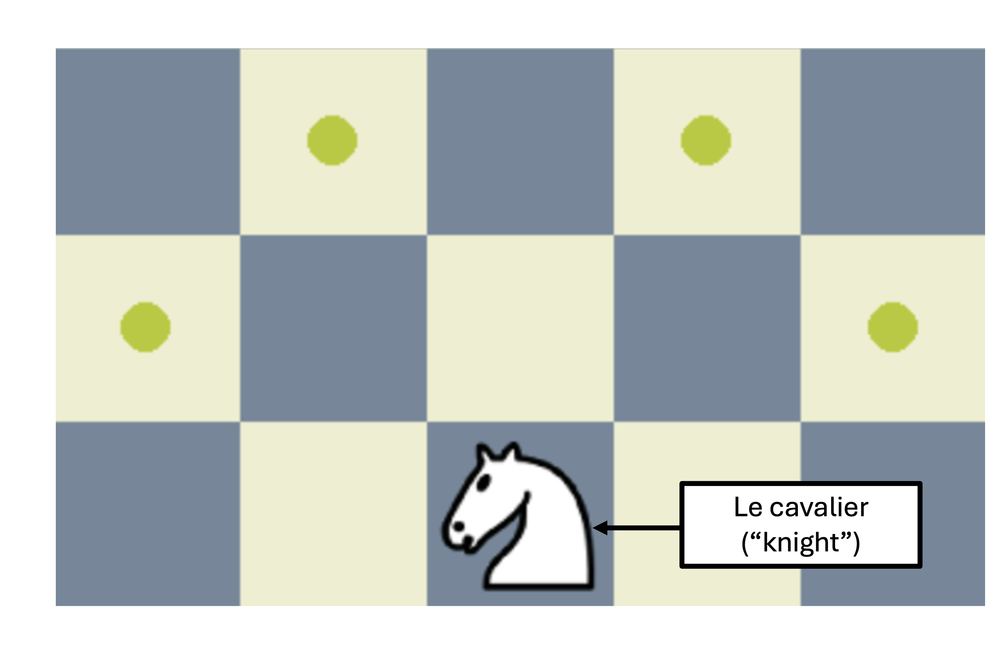

#### 2.2 : Classe `Rook` (Tour)

La tour ("rook") se déplace en ligne droite suivant ainsi la ligne ou la colonne correspondant à sa position de départ. Lors de ce déplacement, elle peut se déplacer d'autant de cases qu'elle le souhaite. 

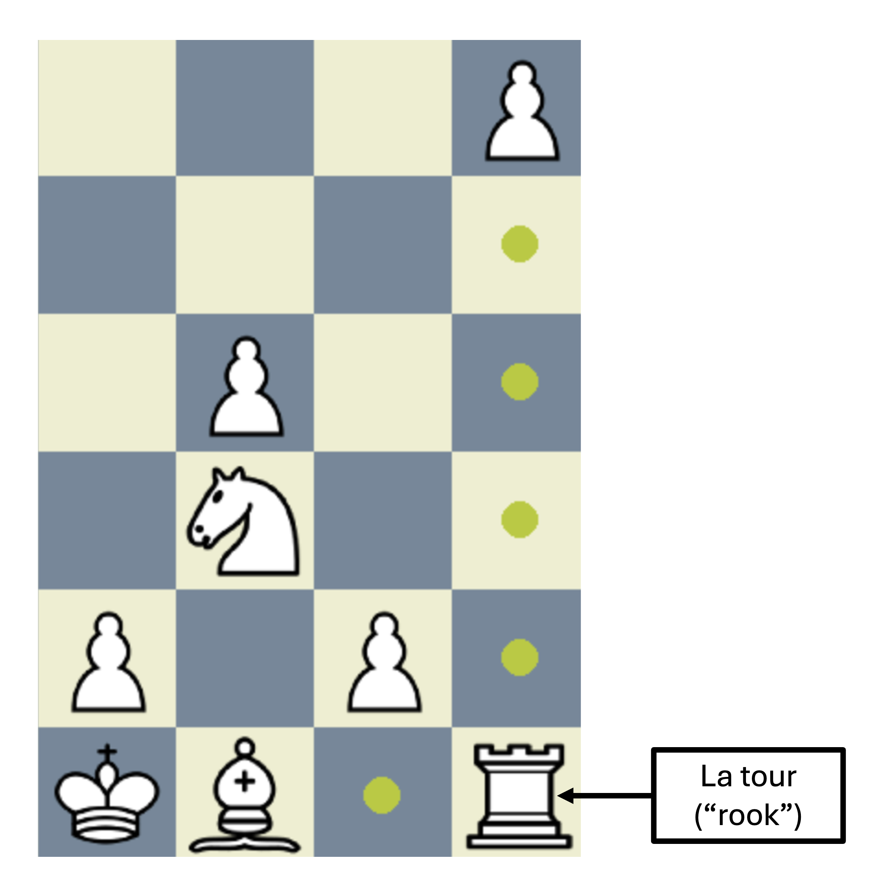


#### 2.3 : Classe `Bishop` (Fou)

Le fou ("bishop") se déplace en suivant les diagonales correspondantes à sa position de départ. Lors de ce déplacement, celui-ci peut se déplacer d'autant de cases qu'il le souhaite.

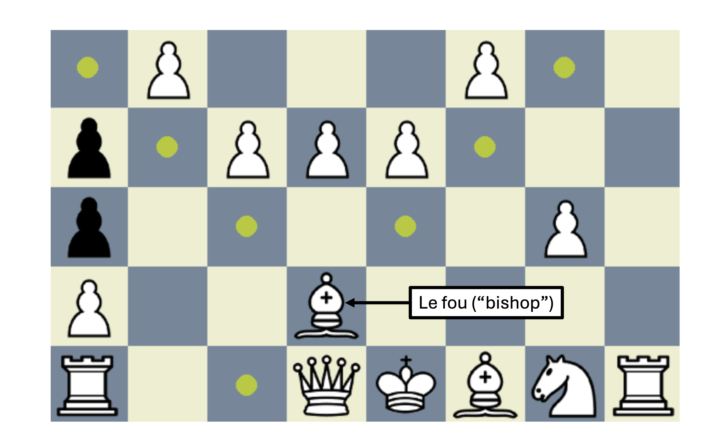

#### 2.4 : Classe `Queen` (Reine)

La reine ("queen") combine à la fois les déplcaments de la tour (en lignes droites) et du fou (en diagonale).

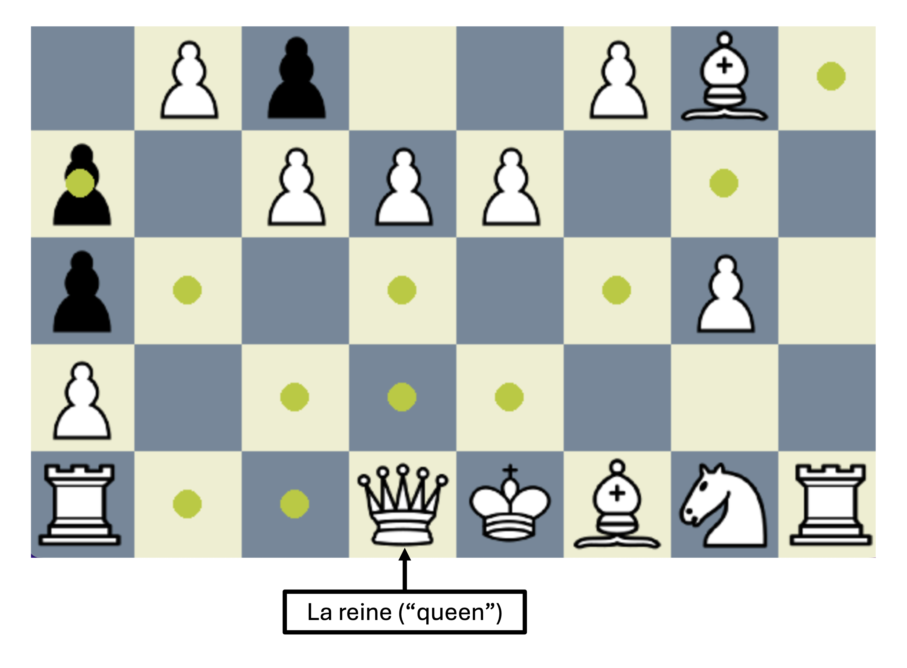

#### 2.5 : Classe `King` (Roi)

Le roi ("king") peut se déplacer d'une seule case à la fois, dans n'importe quelle direction (haut, bas, gauche ou droite). 

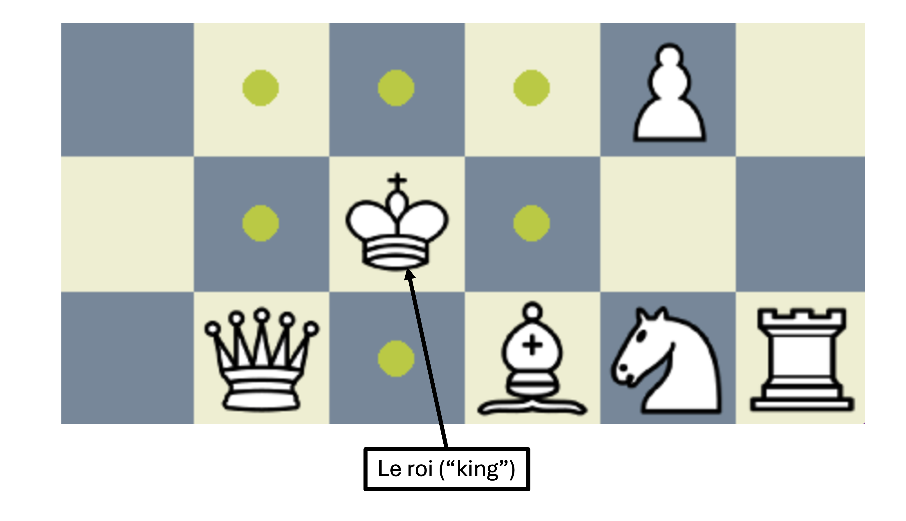

#### Classe `Pion` (Pawn)

Le pion peut se déplacer d'une seule case en avant (figure B), sauf lors de son premier mouvement, où il peut avancer de deux cases ou d'une seule case (figure A). Le pion est la seule pièce qui ne peut pas capturer en suivant son déplacement normal. ce dernier ne peut capturer qu'en diagonale en avant.

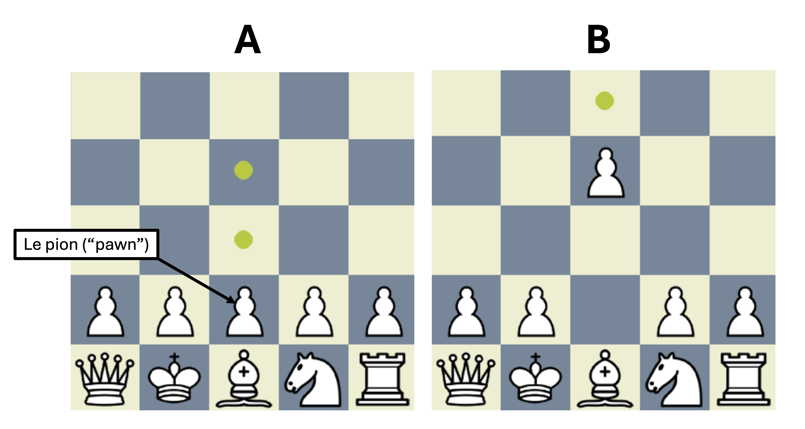

À noter que le mouvement du pion a déjà été implémenté pour vous dans la classe `Pawn`. 

### Partie 3 : Compléter la fonction `is_check` 

Vous devez maintenant compléter la fonction `is_check`, qui se retrouve dans le fichier `pieces.py`. Cette fonction va déterminer si une position donnée de l'objet `Board` contient un **échec** pour la couleur `color` (c'est-à-dire, si le roi de la couleur donnée peut être capturé).

### Partie 4 : Compléter la méthode `legal_moves`

Dans la partie 2, nous avons défini la méthode `get_pos` renvoyant tous les mouvements possibles d'une pièce à l'instant t. Cependant, cette méthode ne tient pas compte d'une règle essentielle des échecs disant qu'un mouvement n'est **LÉGAL** que si ce dernier ne vient pas mettre en danger la sécurité de son roi. Autrement dit, le mouvement du'une pièce blanche ne **PEUT PAS** générer un échec sur le roi blanc. Par exemple dans cette position, c'est au tour des blancs de jouer mais ces derniers ne peuvent pas jouer leur cavalier en position (5,2) car tous mouvements de ce dernier viendrait générer un échec sur le roi, ce qui n'est pas **LÉGAL**.

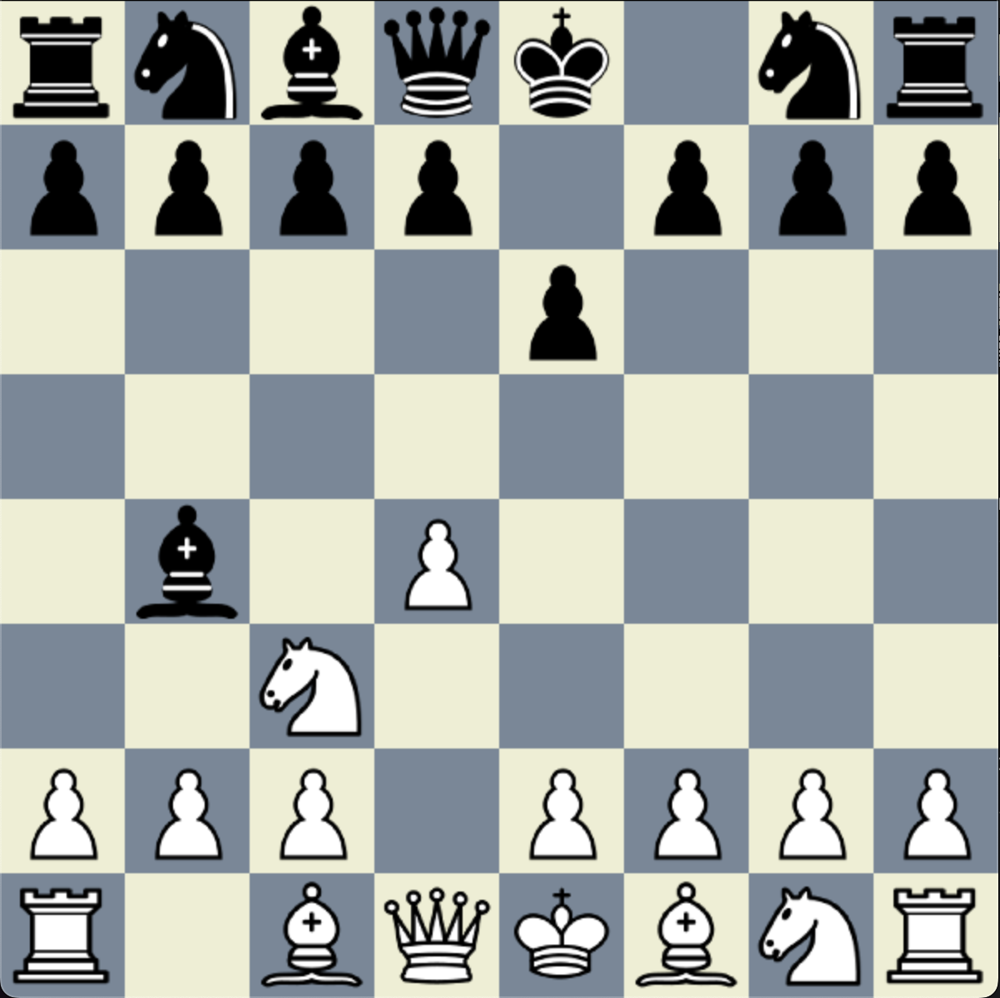

Pour palier ce problème, vous devrez compléter la méthode `legal_moves` dans la classe parente `Piece` (car commune à toutes les pièces). Cette méthode a pour objectif de venir *simuler* chacun des mouvements renvoyés par la méthode `get_pos` et d'ajouter uniquement les mouvement **LÉGAUX** dans une nouvelle liste appelée `legal_moves`. Afin de vérifier qu'un mouvement est **LÉGAL**  vous devrez utiliser la fonction `is_check` créée dans la partie 3 ainsi que la méthode `move_piece` développée dans la partie 1.3.

> Note: Afin de *simuler* les différents coups sans modifier la position du plateau de jeu, nous utiliserons des **copies** de l'objet `Board` à l'aide de la fonction `deepcopy`.

### Partie 5 : Recherche (2 point)

Programmer ne résume pas à compléter des fonctions à trous. Pour cette raison, cette partie fera appel à votre compréhension globale du code et à votre capacité à l'adapter. Votre objectif sera de venir intégrer au choix **UN** des mouvements suivant:
- Le roque (ou castle)
- La prise en passant

À part l'explication des coups qui suit, aucune autre directive ne sera donnée concernant la manière de programmer ces coups. Ce sera à vous uniquement de déterminer s'il faut modifier/ajouter de nouveaux éléments au code.

> ⚠️ Pour conserver les points des autres parties il faudra également s'assurer que vos modifications n'affectent pas le reste du code. Une bonne utilisation de git est par conséquent recommandée.

Pour faciliter la correction, il vous sera demandé de créer un fichier additionnel (`RECHERCHE.md`) dans le repertoire contenant le nom du coup que vous avez essayé d'implémenter ainsi que votre raisonnement pour le faire.

#### Le roque (castle)

Le roque est un déplacement spécial aux échecs faisant intervenir à la fois le roi et une tour. Ce déplacement n'est possible que si:
- le roi n'a jamais bougé
- la tour correspondante n'a jamais bougé
- il n'y a aucune pièce entre le roi et la tour
- le roi ne passe pas par une case intermediare le mettant en échec

Il existe deux types de roque:
- le petit roque (king side castle)
- le grand roque (queen side castle)

Petit roque chez les blancs
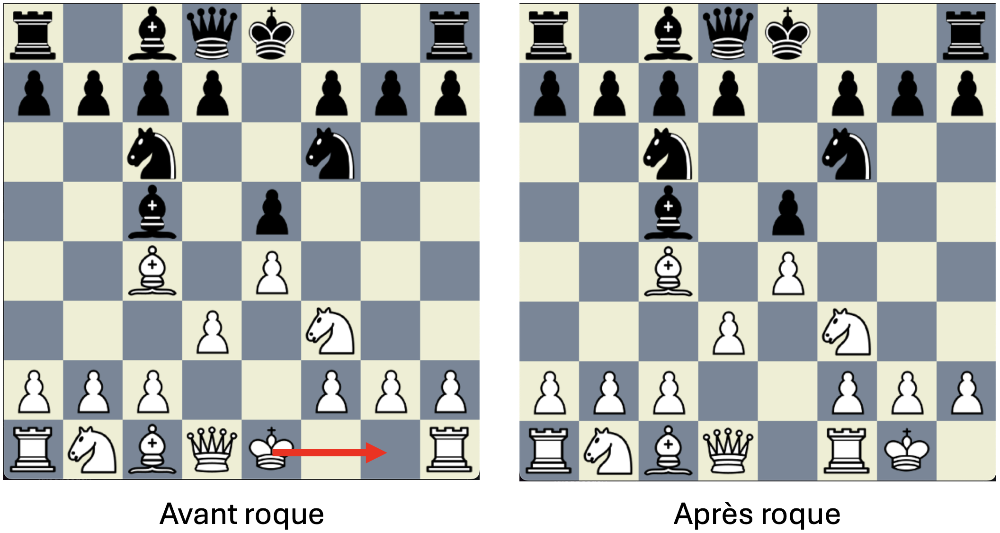

Grand roque chez les noirs
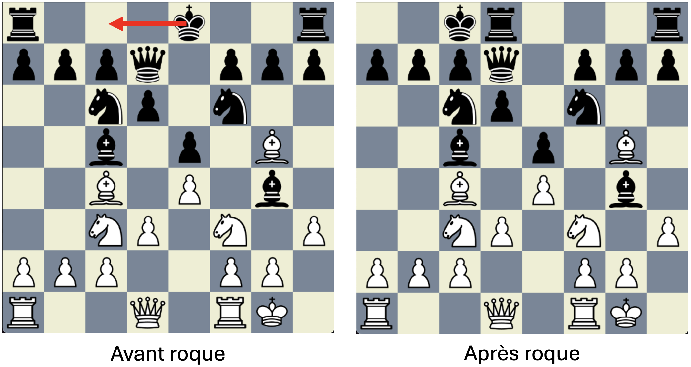

> Ce déplacement doit être obtenu à l'aide d'un seul mouvement. Il est possible à la fois chez les blancs et les noirs.

#### La prise en passant

La prise en passant est un mouvement de capture spécial du pion A (Position 3) sur un autre pion B. Cette capture n'est possible que si:
- le pion A se trouve déjà sur la rangée 3 pour les blancs ou 4 pour les noirs. (Position 1)
- la dernière pièce qui a bougé est le pion B et il a avancé de deux cases (Position 2)
- la case finale du pion B est adjacente à la case de départ du pion A. (Position 2)


> ⚠️ La prise en passant n'est possible que le tour suivant l'avancée du pion B, **PAS** après.

## Barème de correction

Le barème de correction est le suivant : 

| **Partie**                                | **Tâche**                                                                 | **Points** |
|-------------------------------------------|---------------------------------------------------------------------------|------------|
| **Partie 1 : Initialisation du jeu** |                                                                           | **/4**     |
|      Initialisation du plateau            | 1.1 | 2          |
|      Passage du tour            | 1.2  | 0.5          |
|      Mouvement de pièce            | 1.3  | 1.5          |
| **Partie 2 : Classes pour les différentes pièces** |                                                               | **/4**     |
|      Cavalier          | 2.1 | 0.8          |
|      Tour          | 2.2 | 0.8          |
|      Fou          | 2.3 | 0.8          |
|      Dame          | 2.4 | 0.8          |
|      Roi          | 2.5 | 0.8         |
| **Partie 3 : Fonction is_check** |                                                                    | **/4**     |
|      Trouver la position du roi         | 3.1 | 1          |
|      Vérifier s'il y a un échec           | 3.2 | 3          |
| **Partie 4 : Méthode legal_moves** |                                                                    | **/4**     |
|      Bien utiliser les copy            | 4.1 | 1          |
|      Renvoyer la bonne liste des coups légaux             | 4.2 | 3          |
| **Partie 5 : Recherche** |                                                                    | **/4**     |
|      Le raisonnement est bon dans le fichier `RECHERCHE.md`             | 5.1 | 1          |
|      Le coup est correctement implémenté             | 5.2 | 3          |
| **Total**                                 |                                                                           | **/20**    |
